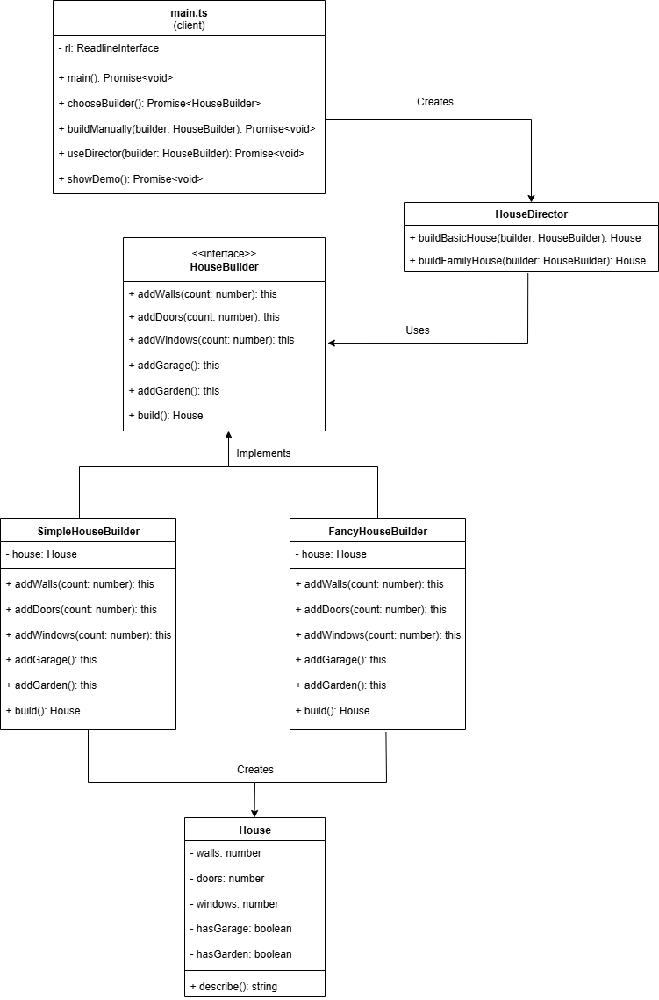

# House Builder Pattern

Simple TypeScript implementation of the Builder Design Pattern using house construction simulation.

## Overview

Build houses step-by-step using different construction teams. Learn the Builder Pattern through a console interface that lets you create houses with walls, doors, windows, garage, and garden.

## Project Structure

```
houseBuilderPattern/
├── asset/
│   ├── Builder.png
├── src/
│   ├── builders/
│   │   ├── houseBuilder.interface.ts
│   │   ├── simpleHouseBuilder.ts
│   │   └── fancyHouseBuilder.ts
│   ├── models/
│   │   └── house.model.ts
│   ├── services/
│   │   └── houseDirector.ts
│   ├── utils/
│   │   ├── inputValidator.ts
│   │   └── errorHandler.ts
│   └── mainApplication.ts
├── tsconfig.json
├── package.json
└── README.md
```

## UML Class Diagram



## Setup

```bash
git clone https://github.com/yourusername/houseBuilderPattern.git
cd houseBuilderPattern
npm install
npm run dev
```

## Usage

Run the application to see an interactive menu:

```
1. Build a house manually
2. Use pre-made house plans (Director)
3. See demo comparison
4. Exit
```

### Manual Building

Choose Simple or Fancy builder, then add components step by step.

### Director Plans

Use pre-made plans:

- Basic House: 4 walls, 1 door, 4 windows
- Family House: 6 walls, 2 doors, 8 windows + garage + garden

## Code Example

```typescript
const builder = new SimpleHouseBuilder();
const house = builder.addWalls(4).addDoors(2).addWindows(6).addGarage().build();

console.log(house.describe());
// Output: "House with 4 walls, 2 doors, 6 windows, garage"
```

## Builder Types

**SimpleHouseBuilder**: Builds exactly what you request
**FancyHouseBuilder**: Upgrades everything (adds 2 extra walls, doubles windows)

## Pattern Benefits

- Step-by-step object construction
- Readable method chaining
- Same construction process, different results
- Flexible feature addition
- Clean separation of construction logic

## Sample Output

### Main Menu

```
House Builder Pattern Demo

==================================================
What would you like to do?
1. Build a house manually
2. Use pre-made house plans (Director)
3. See demo comparison
4. Exit
Enter choice (1-4):
```

### Manual Building Example

```
Choose your construction team:
1. Simple Builder (normal houses)
2. Fancy Builder (luxury houses)
Enter choice (1 or 2): 2
You chose Fancy Builder!

Let's build your house step by step!
How many walls? (1-10): 4
Added 4 walls
How many doors? (1-5): 2
Added 2 doors
How many windows? (1-20): 6
Added 6 windows
Do you want a garage? (y/n): y
Added garage
Do you want a garden? (y/n): y
Added garden

Your custom house: House with 6 walls, 2 doors, 12 windows, garage, garden
```

### Director Plans Example

```
Choose a pre-made house plan:
1. Basic House (4 walls, 1 door, 4 windows)
2. Family House (6 walls, 2 doors, 8 windows + garage + garden)
Enter choice (1 or 2): 2
Built Family House!

Your house: House with 8 walls, 2 doors, 16 windows, garage, garden
```

### Demo Comparison

```
Demo of different builders:
Simple Builder Result: House with 6 walls, 2 doors, 8 windows, garage, garden
Fancy Builder Result: House with 8 walls, 2 doors, 16 windows, garage, garden
Notice how the same plan gives different results!
```

## Input Validation

Basic validation for:

- Wall count: 1-10
- Door count: 1-5
- Window count: 1-20
- Yes/no inputs for garage and garden

## Built By

Ms Hamsini S
