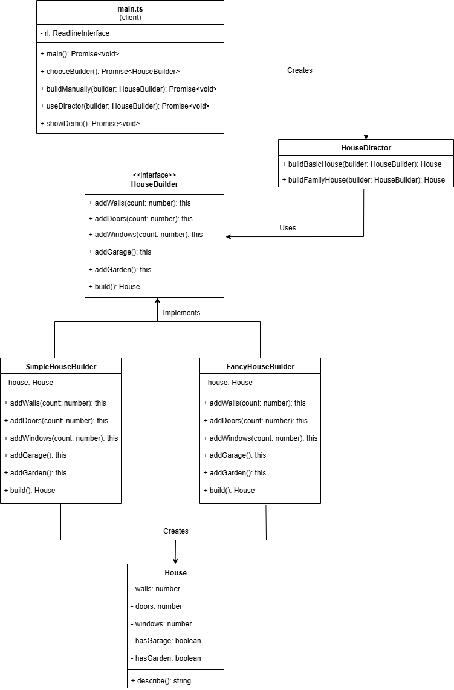

# House Builder Pattern

A TypeScript implementation of the Builder Design Pattern using a house construction example.

## Overview

The Builder Pattern is a creational design pattern that allows you to construct complex objects step by step. This implementation demonstrates the pattern using house construction, showing how different builders can create different types of houses using the same construction process.

## UML Class Diagram



## Features

- Interactive CLI demonstration
- Multiple builder implementations (Simple and Fancy)
- Director pattern for pre-configured house plans
- Fluent interface with method chaining
- Full TypeScript support

## Project Structure

```
├── house.ts                    # House entity class
├── house-builder.interface.ts  # Builder interface
├── simple-house-builder.ts     # Basic builder implementation
├── fancy-house-builder.ts      # Luxury builder implementation
├── house-director.ts           # Director for pre-made plans
├── main.ts                     # Interactive CLI demo
├── package.json
├── tsconfig.json
└── README.md
```

## Installation

1. Clone the repository
   ```bash
   git clone https://github.com/Hamsini-1223/Builder-Method-Design-Pattern
   cd  Builder
   ```
2. Install dependencies:
   ```bash
   npm install
   ```
3. Build the project:
   ```bash
   npm run build
   ```

## Usage

### Run the Interactive Demo

```bash
# Development mode
npm run dev

# Production mode
npm start
```

### Programmatic Usage

```typescript
import { SimpleHouseBuilder } from "./simple-house-builder";
import { FancyHouseBuilder } from "./fancy-house-builder";
import { HouseDirector } from "./house-director";

// Manual construction
const builder = new SimpleHouseBuilder();
const house = builder.addWalls(4).addDoors(2).addWindows(6).addGarage().build();

console.log(house.describe());
// Output: "House with 4 walls, 2 doors, 6 windows, garage"

// Using Director with different builders
const director = new HouseDirector();
const simpleHouse = director.buildFamilyHouse(new SimpleHouseBuilder());
const fancyHouse = director.buildFamilyHouse(new FancyHouseBuilder());
```

## Architecture

### Core Components

**House**: The complex object being constructed with properties for walls, doors, windows, garage, and garden.

**HouseBuilder Interface**: Defines the construction steps with methods for adding components and building the final house.

**Concrete Builders**:

- `SimpleHouseBuilder`: Creates standard houses
- `FancyHouseBuilder`: Creates luxury houses with enhanced features

**Director**: Encapsulates construction logic for common configurations (Basic House, Family House).

## Builder Implementations

### SimpleHouseBuilder

Creates houses with standard specifications as requested.

### FancyHouseBuilder

Creates luxury houses with enhancements:

- Extra reinforced walls (+2 walls)
- Double windows for better lighting
- Maintains same interface as SimpleHouseBuilder

## Examples

### Basic Construction

```typescript
const builder = new SimpleHouseBuilder();
const house = builder.addWalls(4).addDoors(1).addWindows(4).build();
```

### Using Director

```typescript
const director = new HouseDirector();
const basicHouse = director.buildBasicHouse(new SimpleHouseBuilder());
const familyHouse = director.buildFamilyHouse(new FancyHouseBuilder());
```

## Output

### Interactive Demo Output

```
🏠 Welcome to the House Builder Pattern Demo! 🏠

==================================================
What would you like to do?
1. Build a house manually
2. Use pre-made house plans (Director)
3. See demo comparison
4. Exit
Enter choice (1-4): 3

📺 Here's a quick demo of different builders:
Simple Builder Result: House with 6 walls, 2 doors, 8 windows, garage, garden
Fancy Builder Result: House with 8 walls, 2 doors, 16 windows, garage, garden
👆 Notice how the same plan gives different results!
```

### Programmatic Output Examples

```typescript
// SimpleHouseBuilder with basic house
console.log(basicHouse.describe());
// Output: "House with 4 walls, 1 doors, 4 windows"

// FancyHouseBuilder with family house
console.log(fancyHouse.describe());
// Output: "House with 8 walls, 2 doors, 16 windows, garage, garden"

// Manual construction
console.log(customHouse.describe());
// Output: "House with 6 walls, 3 doors, 10 windows, garage"
```

## Development

### Available Scripts

```bash
npm run build    # Compile TypeScript
npm run dev      # Run with ts-node
npm start        # Run compiled JavaScript
```

### Extending the Pattern

To add a new builder type:

1. Implement the `HouseBuilder` interface
2. Define unique construction logic
3. Add to the interactive demo if desired

## Built By

Ms Hamsini S
